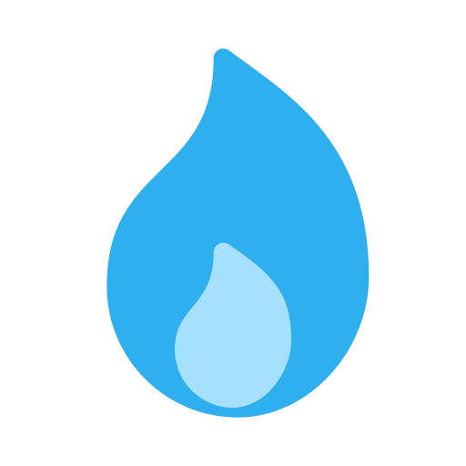

# This is a title
## This is a subtitle

<!-- This is a comment -->

This is a paragraph

- This is a list
    - This is a sublist
- This is another list
- This is a third list

1. This is a numbered list
    1. This is a subnumbered list
2. This is another numbered list
3. This is a third numbered list

This is a paragraph with a [link](https://www.google.com)

This is a paragraph with a custom [link](https://www.google.com "Google")

This is a paragraph with an image with width atribute 

This is a paragraph with an image 

This is an *italic* word

This is a **bold** word

This is a ***bold and italic*** word

This is a ~~strikethrough~~ word

This is a `code` word

This is a paragraph with a block of code:
```python
print("Hello World")
```

> This is a quote

---
___

This is a table:

| Header 1 | Header 2 | Header 3 |
|----------|----------|----------|
| Data 1   | Data 2   | Data 3   |
| Data 4   | Data 5   | Data 6   |


<!--Github Markdown-->
## Github Markdown

This is a paragraph with a task list:
- [x] Task 1
- [ ] Task 2
- [ ] Task 3

This is a paragraph with a mention @username

This is a paragraph with an emoji :smile: